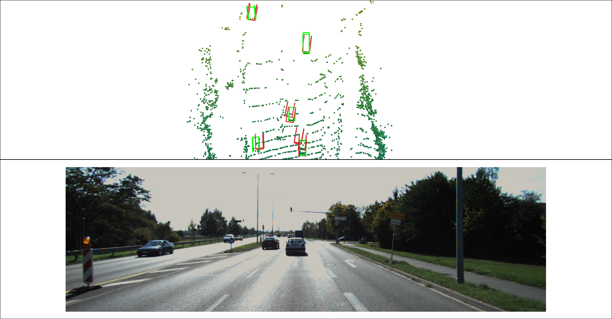

# 3D Monocular object detection

Relatively simple 3D monocular object detection pipeline written in `tensorflow 2`.

## Approach



We treat 3D monocular object detection as a regression task to estimate a per object 7-DOF exterior orientation. We define the 7-DOF orientation as X, Y, Z, Height, Width, Depth, Rotation. Rotation is defined as angle around the Y-axis. To ensure a continuous learning space we define the rotation about the Y-axis as a 2 value vector direction i, j. Finally, we have a classication network to predict per-object class.

The first part of the network consists of a VGG encoder which encodes the input image `I` in a latent space vector `z` (i.e. `I -> z`). A small MLP then regresses object X, Y, Z directly from this latent code (`z -> centers`). We treat these as standard unordered point sets and apply a chamfer distance loss function between the ground truth centers and the predicted centers. We optimise the gradients of the VGG encoder and center MLP soley on the gradients from the chamfer loss function.

To obtain object extent, orientation and classification we first project the predicted centers (as outputted from the center network MLP) back to the camera plane to calucalte the center pixel coordinates. We then crop a small patch around this center from the original input image. This is done as many times as there are proposals (i.e. 1 center -> 1 patch). Next, we pass the patches `P` into a smaller AlexNet CNN encoder to obtain a second latent code `z_` (i.e. `P -> z_`). We then pass the shared latent code through 3 small MLP branches. The branches output extent (3 parameters), orientation (2 parameters) and classification (`k` parameters, where `k` is number of classes).

To apply a standard Mean Squared Error loss function we use the indexes from the chamfer distance to match each prediction with is closest ground truth. If the distance between the predicted and ground truth is below a threshold we calculate a per predicition loss between their attributes. We train the AlexNet and 3MLP's using these gradients.

## Setup

All dependencies can be install in a python virtual environment using pip:

```
virtualenv -p <python_path>/python3 ./env
source ./env/bin/activation
pip install -r requirements.txt
```

## Training

To use the standard kitti dataset example you must first download the kitti dataset from [here](http://www.cvlibs.net/datasets/kitti/eval_object.php?obj_benchmark=3d). Once downloaded set the `in_dir` value in the config dictionary in `utils/create_tfrecord.py` to the kitti downolad root folder. The tfrecords can be generated by running:

```
python utils/create_tfrecord.py
```

By default the class map ground `cars`, `trucks` and `vans` as a single class and sets everything else to `dont care`. You can change this by editing the values in `CLASS_MAP` located at the top of `datasets/kitti_utils`. We also provide an example for all classes.

We provide 2 examples for training configs. One for single class (`configs/kitti_single.toml`) and a mulit-class (`configs/kitti_multi.toml`). Ensure these match the parameters set when generating the dataset. Once configured correctly training can be begin by running:

```
python network/train <config_path>
```

Training logs can be visulaised using tensorboard:

```
tensorboard --logdir=./logs --port=6006
```

Then browse to `localhost:6006` in your web browser.

## Evaluation

Evaluation can be configured be editing the `cfg` dictionary at the bottom of `network/evaluate.py`. Once set to your trained model and dataset you can begin evaluation with:

```
python network/evaluate.py
```

## Inference

We can visualise results in 3D along with the respective scene 3d point cloud using `pyvista`. First, set the global variables at the bottom of `network/inference.py` to load the correct model, dataset. Then simply run:

```
python network/inference.py
```

The resulting 3D scene should appear on the default monitor. If no monitor is available (i.e. on a remote server), set `VIS = False` and a screenshot will be saved to the `SCREENSHOT_SAVE_DIR` variable location.